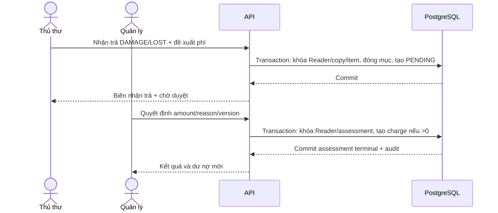

# Đặc tả duyệt phí hỏng và mất sách

**Ngày đồng bộ:** 2026-10-07 · **Trạng thái:** Đặc tả thiết kế, chưa phải triển khai/nghiệm thu.

Nguồn: DOCX chính, Google Docs live và các quyết định đã duyệt trong [decisions](../plan/decisions.md). Khi nguồn cũ mâu thuẫn, quyết định trực tiếp của người dùng được áp dụng; thuộc tính gốc giữ theo DOCX.

## Quy tắc được duyệt

Thủ thư nhận trả/ghi nhận mất ngay và đề xuất số tiền có lý do. Quản lý xác nhận trước khi tạo FineCharge. PENDING chặn checkout/renew/reservation-create; không chặn return, cancel hoặc đọc dữ liệu. Dư nợ đã ghi tính từ ledger, tách khỏi số hồ sơ PENDING; không coi proposed_amount là debt.

## Trạng thái và API

| Từ | Lệnh/quyền | Đến | Tác động |
| --- | --- | --- | --- |
| Không có | Return DAMAGE/LOST, assessment.propose | PENDING | Đóng LoanItem và tạo ReturnEvent; giữ copy REPAIR/LOST; tạo assessment trong cùng transaction |
| PENDING | POST /charge-assessments/{id}/decisions, assessment.decide, amount>0 | ASSESSED | Tạo một FineCharge, liên kết fine_charge_id; lưu người duyệt/thời điểm/lý do |
| PENDING | Cùng lệnh, amount=0 | CLOSED_NO_CHARGE | Lưu lý do không thu; không tạo charge0 |
| ASSESSED/CLOSED_NO_CHARGE | Retry cùng key/payload | Giữ nguyên | Trả kết quả cũ |
| Terminal | Request khác muốn duyệt lại | Giữ nguyên | 409; điều chỉnh khoản đã ghi dùng miễn/đảo ledger, không sửa assessment |

PENDING không có đường hủy ngầm để bỏ chặn; xử lý sai tình trạng bằng quyết định có lý do. Không có tỉ lệ bồi thường tự động hoặc bảng giá được bịa. Sách hỏng/mất không tự AVAILABLE khi không thu phí; phục hồi bản sao dùng command kiểm tra riêng.

## Hợp đồng

POST /returns nhận loanItemId, condition, notes và assessment khi DAMAGE/LOST gồm proposedAmount/reason; không nhận returnedAt/processedBy từ client. GOOD không nhận assessment. Quản lý quyết định với expectedVersion, amount và reason. Server kiểm tra permission; proposer/decider là Account từ phiên, không do client chỉ định.

## Cạnh tranh và bất biến

Khóa Reader theo thứ tự chung trước Return/Assessment/Charge. Checkout/renew/hold cũng khóa Reader và kiểm tra PENDING dưới khóa. Nếu pending được tạo trước, lệnh lưu thông bị chặn; nếu checkout commit trước, phiếu đã cấp không bị hồi tố. UQ return_event_id+kind và fine_charge_id bảo vệ duyệt trùng; idempotency hash payload. Return phí trễ có thể tạo ngay theo snapshot và vẫn tạo assessment riêng cho mất/hỏng.

## Trình tự

## Nghiệm thu

Hai lần duyệt không nhân phí; PENDING chặn đúng ba lệnh; return luôn được về điều kiện phí; amount0 không charge; reason/permission/version thiếu bị từ chối; timeout sau commit retry trả kết quả cũ. Tìm lại sách mất không mở LoanItem cũ hoặc tự đảo phí.

Ánh xạ command: GOOD → ReturnEvent.return_kind=RETURNED, condition=GOOD; DAMAGE → RETURNED/DAMAGED; LOST → LOST/condition=NULL. Mất không được ghi như đã nhận sách.
